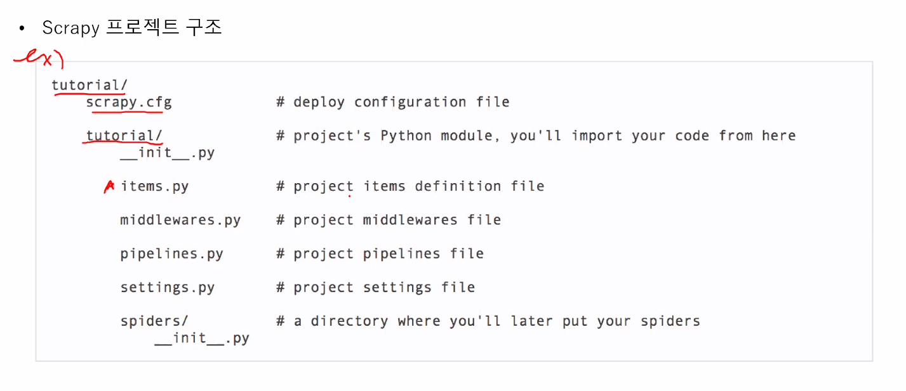
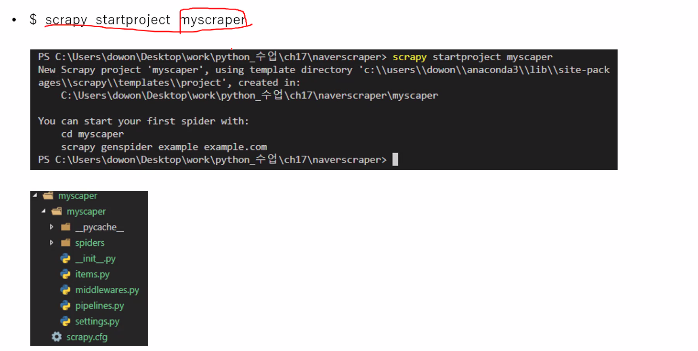
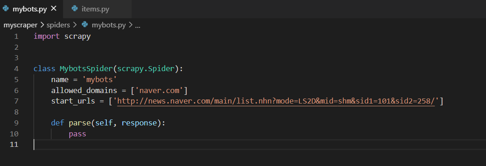
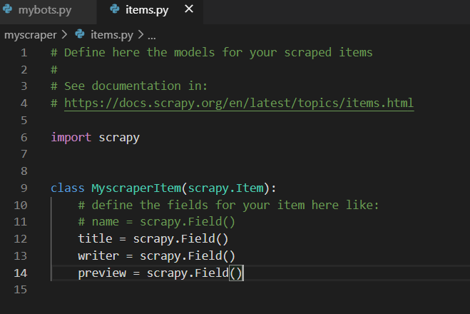
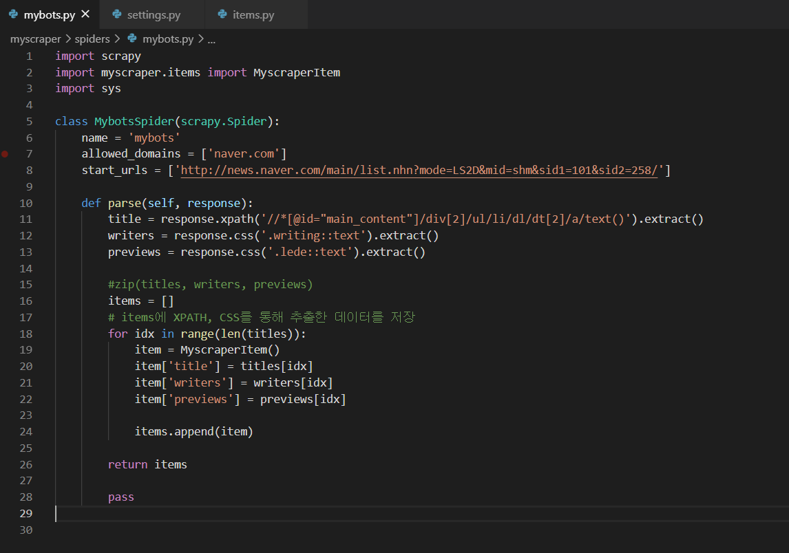
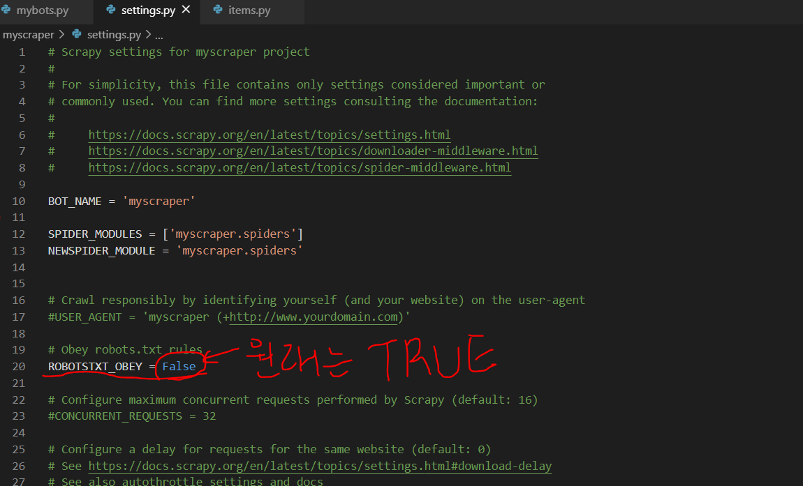
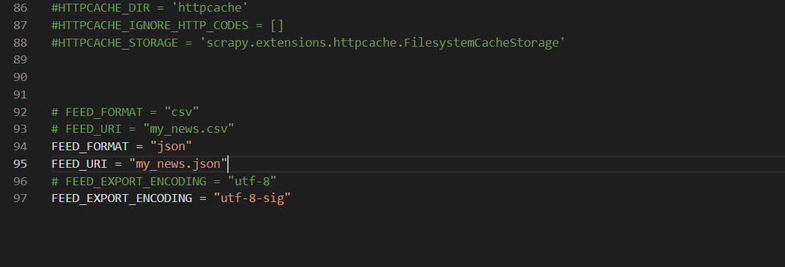

# Scrapy 프로젝트

--------------------------------------------------------------------------------------------------------------------------------------------------------

아나콘다 프롬프트 해당 경로에 

(myscrapy) C:\work\scrapy> scrapy startproject myscraper  // 프로젝트 생성

(myscrapy) C:\work\scrapy>cd myscraper

(myscrapy) C:\work\scrapy\myscraper>code .   // vscode 가 실행될거임.

(myscrapy) C:\work\scrapy\myscraper>scrapy genspider mybots "news.naver.com/main/list.nhn?mode=LS2D&mid=shm&sid1=101&sid2=258"   // mybots 은 내가 생성하고 싶은 스파이더 이름, (" ") <-여기 안에는 해당 주소를 넣어줌, 도메인 주소만(http 빼고)

VS code

[spider/mybots.py 수정]

[myscraper/items.py 수정]

[spider/mybots.py 2차 수정]

[myscraper/settings.py 수정]

저장 후 

아나콘다 프롬프트로 가서 

(myscrapy) C:\work\scrapy\myscraper>scrapy crawl mybots

페이징 처리는 (myscraper) 코드에서 확인

